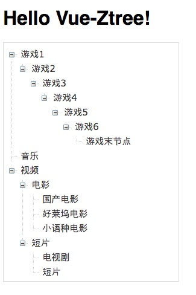

# vue-ztree

[vue-ztree-2.0 版本地址](https://github.com/lisiyizu/vue-ztree-2.0)



通过以下demo来实现

###app.vue代码如下

```html
<template>
  <div id="app">
    <h1>{{ msg }}</h1>
    <div style='width:280px;'>
      <vue-ztree :list.sync='ztreeDataSource' :func='nodeClick' :is-open='true'></vue-ztree>
    </div>
  </div>
</template>

<script>
import vueZtree from './component/vue-ztree.vue'
export default {
  data () {
    return {
      msg: 'Hello Vue-Ztree!',
      ztreeDataSource:[{
                id:1,
                name:"音乐",
                children:[]
      },{
          id:2,
          name:"视频",
          children:[{
             id:3,
             name:"电影",
             children:[{
                id:4,
                name:"国产电影"
             },{
                id:5,
                name:"好莱坞电影"
             },{
                id:6,
                name:"小语种电影"
             }]
          },{
             id:7,
             name:"短片",
             children:[{
                id:9,
                name:"电视剧"
             },{
                id:10,
                name:"短片"
             }]
          }]
      }]
    }
  },
  methods:{
    nodeClick:function(m){
       console.log(JSON.parse(JSON.stringify(m)));
    }
  },
  components:{
    vueZtree
  }
}
</script>

<style>
body {font-family: Helvetica, sans-serif;}
</style>

```

###vue-ztree/初始化参数
<table  border="0" align="left">
	<tbody>
		<tr>
			<td >参数</td>
			<td >类型</td>
			<td >默认值</td>
			<td >描述</td>
		</tr>
		<tr>
			<td >list</td>
			<td >Array</td>
			<td >-</td>
			<td >树的结构数据源</td>
		</tr>
		<tr>
			<td >func</td>
			<td >Function</td>
			<td >-</td>
			<td >点击节点回调的方法</td>
		</tr>
		<tr>
			<td >is-open</td>
			<td >Bealoon</td>
			<td >true</td>
			<td >是否展开树</td>
		</tr>
	</tbody>
</table>


## Build Setup

``` bash
# install dependencies
npm install

# serve with hot reload at localhost:8080
npm run dev

# build for production with minification
npm run build
```

For detailed explanation on how things work, consult the [docs for vue-loader](http://vuejs.github.io/vue-loader).
